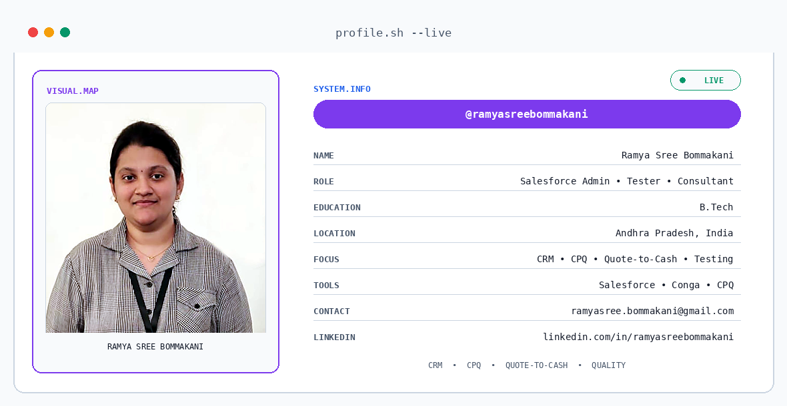
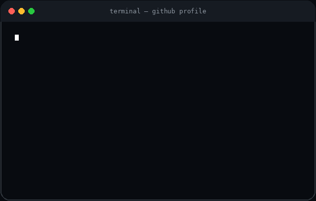
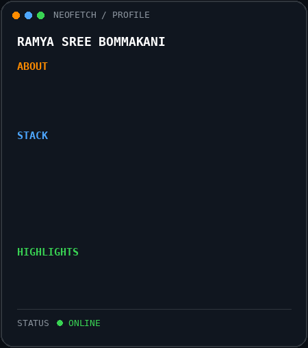
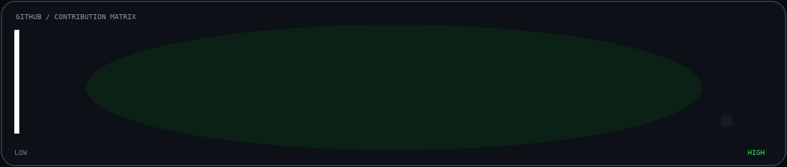

  <picture>
    <source media="(prefers-color-scheme: dark)" srcset="./github-banner-dark-clean.png">
    <source media="(prefers-color-scheme: light)" srcset="./github-banner-light-clean.png">
    
  </picture>

<h1 align="center">Hi, I'm Ramya Sree Bommakani 👋</h1>

  <strong>Salesforce Admin • Tester • Consultant</strong>

  🏆 <strong>7× Salesforce Certified</strong>
  &nbsp; | &nbsp;
  🚀 <strong>5× Copado Certified</strong>

  Salesforce Administration • CRM • CPQ • Testing • Quote-to-Cash • Conga • Copado

  
  &nbsp;
  
  &nbsp;
  

---

<!-- PREMIUM_GITHUB_PROFILE_START -->

<table>
<tr>

<td width="59%" valign="top">

</td>

<td width="41%" valign="top">

</td>

</tr>
</table>

 

<!-- PREMIUM_GITHUB_PROFILE_END -->

---

## 👩‍💻 About Me

I'm **Ramya Sree Bommakani**, a B.Tech professional focused on the **Salesforce ecosystem**.

My professional focus includes **Salesforce Administration, CRM, CPQ, Testing, Quote-to-Cash, Conga and Copado**, with a strong focus on business process understanding, solution validation and quality assurance.

I enjoy understanding business requirements, validating Salesforce solutions, identifying defects and supporting reliable CRM solutions through effective testing and process validation.

---

## 🏆 Certifications

### ☁️ Salesforce Certifications

| # | Certification |
|---|---|
| 1 | **Salesforce Certified CRM Analytics and Einstein Discovery Consultant** |
| 2 | **Salesforce Certified Marketing Cloud Engagement Specialist** |
| 3 | **Salesforce Certified Platform App Builder** |
| 4 | **Salesforce Certified Platform Developer** |
| 5 | **Salesforce Certified Platform Administrator** |
| 6 | **Salesforce Certified JavaScript Developer I** |
| 7 | **Salesforce Certified AI Associate** |

### 🚀 Copado Certifications

| # | Certification |
|---|---|
| 1 | **Copado AI Certified** |
| 2 | **Copado Fundamentals I SFP Certified** |
| 3 | **Copado Fundamentals II SFP Certified** |
| 4 | **Copado Essentials+ Certified** |
| 5 | **Copado Robotic Testing Certified** |

---

## 💼 Salesforce Expertise

| Area | Focus |
|---|---|
| ⚙️ Salesforce Administration | CRM administration and platform support |
| 💼 CRM | Customer relationship management processes |
| 📦 CPQ | CPQ testing and validation |
| 🧪 Testing | Functional and Salesforce-focused testing |
| 🔄 Quote-to-Cash | Q2C process validation |
| 📄 Conga | Conga-related solutions and testing |
| 🚀 Copado | Salesforce DevOps and deployment processes |
| 🔍 Quality Assurance | Requirement validation and defect identification |

---

## 🛠️ Skills & Tools

---

## 🧩 What I Work With

| Salesforce | Business & Quality |
|---|---|
| Salesforce Administration | Functional Testing |
| CRM | CPQ Testing |
| CPQ | Quote-to-Cash |
| Conga | Requirement Validation |
| Copado | Defect Identification |
| Salesforce Processes | Quality Assurance |

---

## 🎓 Education

**B.Tech — Bachelor of Technology**

📍 Andhra Pradesh, India

---

## 🎯 Professional Focus

🏆 <strong>7× Salesforce Certified</strong>

&nbsp; • &nbsp;

🚀 <strong>5× Copado Certified</strong>

&nbsp; • &nbsp;

☁️ <strong>Salesforce Ecosystem</strong>

Salesforce Administration • CRM • CPQ • Testing • Quote-to-Cash • Conga • Copado

---

## 📫 Let's Connect

&nbsp;

&nbsp;

⭐ Thanks for visiting my GitHub profile!

